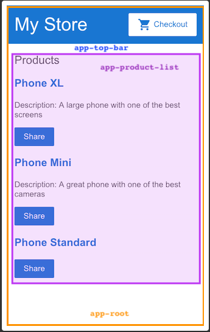

# Try It
Apresenta os fundamentos do angular, orientando voce na construção de um site de comercio 
eletrônico com um catalogo, carrinho de compras e forms de check-out.

## Uma tour pelo app

Voce cria apps angular components . Os componentes definem areas de responsabilidades na interface
de usuário que permite reutilizar um conjunto de funcionalidade da interface de user
U componente consiste em tres coisas

- Uma classe component: trata dados e funcionalidades
- HTML template: Determina a UI.
- Estilo especifico de components: Define o designer da renderização de umm component

Este guia demonstra a criação de um app com os seguintes components:

- \<app-root>: O primeiro component a ser carregado e container para os demais components
- \<app-top-bar>: O nome da loja e o botão de check-out
- \<app-product-list>: A lista de produtos
- \<app-products-alert>: Um component que  contem os alters do app

## Crie uma lista def produtos
Nesta seção voce atualizará o app para exibir uma lista de produto. Voce usará 
dados de produtos predefinidos dor arquivo produtos.ts e métodos do arquivo 
product-list.component.ts. Esta sessão orienta voce na edição do html também 
conhecido como template.

1. abra o arquivo product-list.component.ts
2. adicione a diretiva ngFor em um elemento div

~~~ javascript

~~~

Com o ng for a div se repete para cada produto da list products
3. Dentro da div adicione um h3  e {{product.name}}. A instrução {{product.name}}
é um exemplo de sintaxe de interpolação {{}} permitindo renderizar o valor da 
propriedade como texto

~~~ javascript
<h2>Products</h2>

<h3>{{product.name}}</h3>

~~~

4. para torna cada nome de produto em u link para os detalhes, basta adicionar
a tag <a> em volta de {{product.name}}
5. Defina o title como o nome do produto usando a sintaxe de associação de propriedade(property bind)[]

~~~ javascript
<h2>Products</h2>

<h2> <a [tittle] ="product.name + details" >{{product.name}}</a> </h3>

~~~

6. Adicione as descrições dos produtos em um 
 element. Use a diretiva ngIf para 
que apenas renderize os elementos com se o product.description is not null

~~~ javascript
<h1>Products</h1>

<h3><a>{{p.name}}</a></h3>

{{p.description}}

~~~

6. Adicione um botão para que os users possam compartilhar um produto. Vincule o 
evento de click do botão ao método share. A vinculação do evento usa um conjunto 
de parenteses ao redor do evento, como no evento click no button element

~~~ javascript
<h2>Products</h2>

<h3><a [title] = "p.name + ' details'" >{{p.name}}</a></h3>

Description: {{p.description}}

 <button (click) = "share()" ><button>
~~~

## Passando dados par components filhos
A proxima etapa é criar um novo recurso de alerta que usa dados do produto 
ProductListComponent. O alerta verifica o preço do produto e, se o preço for 
superior a 700, exibi um button notify me, que permite que os users se inscrevam 
para receber a notificação quando o produto estiver a venda.
Esta sessão orienta voce na criação de um component filho, ProductAlertsComponent
que pode receber dados de seu component pai ProductListComponent

comando para gerar um novo component

~~~ bash
ng generate component product-alerts
~~~
O gerador cria arquivos iniciais para as partes do component:

- product-alerts.component.ts
- product-alerts.component.html
- product-alerts.component.css

**Os principais recursos do @Component**
- O selector, app-product-alerts, identifica o component. Por conversão, os 
seletores de components angular começão com o prefixo app- seguido pelo nome do 
componente.
- Os template e style fazem referencia ao html e css do component
-  definição @ Component tbm exporta a class ProductAlertsComponent, que trata da 
funcionalidade do component 

Para configurar o productAlerts para receber dados, primeiro devemos importar o 
Input do @angular/core

~~~ javascript
import {Input} from '@angular/core';
~~~

Na definição da class ProductAlertsComponent, defina uma propriedade chamada 
product com um decorator @Input(), indica que o valor da propriedade passa do pai 
do component, ProductListComponent

Abra product-alters.component.html e reescreva o paragrafo de espaço reservado por
um botão Notifique-me que aparece se o preço do produto for superior que 700

O gerador adicionou automaticamente o ProductAlertsComponent a appModule para 
disponibiliza-lo para outros components no app.

Por fim, para exibir ProductAlertsComponent como filho de productComponent
adicione o elemento <app-product-alerts> a product-list-component.html. Passar o 
produto atual como entrada para o componente usando vinculação de propriedade

## Passando dados para o component pai

Para que o botão notifique me funcione, o component filho precisa notificar e 
passar os dados para o component pai. O ProductAlertsComponent precisa emitir um evento quando o usuário clicar em notifique me e o ProductListComponent precisa
responder ao evento.

Em product-alters.component.ts import Output e EventEmitter do @angular/core

no component defina uma var chamada notify com o decorator @Output que seja uma 
instancia de EventEmitter. Essa configuração permite que ProductAlertsComponent 
emita um evento quando o valor da propriedade for alterada

Em product-alerts.component.html atualize o botão notify com uma chamada de evento
com a callback = notify.emit()

Defina o comportamento de quando o user clica no botão

Atualize o ProductListComponent para receber dados do ProductAlertsComponent