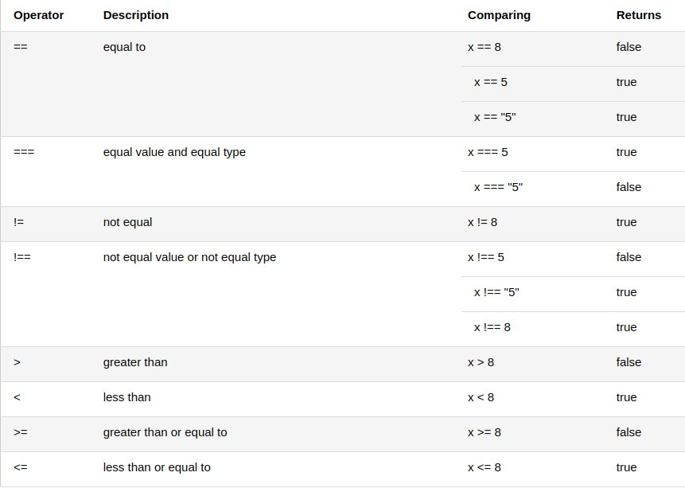

# Comparação e Operadores lógicos

Os operadores logico e de comparação são usados para testar  **true** or **false**

## Operadores de comparação

Os comparadores são usados em expressões logicas para determinar a igualdade ou diferença entre
variáveis ou valores
Diante disso x = 5, a table abaixo explica os operadores de comparação

## Como pode ser usado

Os operadores pode ser usados em instruções condicionais para comparar valores e agir dependendo do
result

~~~ javascript
if (age < 18) txt = 'Too young to buy alcohol';
~~~

## Operadores lógicos
Os logics operators são usados para determinar resultados logics entre vars e values.
Dado que x = 6 e y = 3

## Operadores condicional ternários

JS tbm contem um operador condicional que atribui um valor a uma var com base em alguma condição

**Sintaxe**
~~~ javascript
let variable  = (condition) ? value1 : value2;
~~~

~~~ javascript
let votavel = (age > 18) ? 'SIM' : 'NÃO';
~~~

## Comparando diferentes tipos

Pode gerar saídas unexpected
Ao comparar uma string com um number, O JS converte a string em um number ao fazer
a comparação. Uma string vazia é convertida em zero. Uma string não numérica é convertida em NaN que é sempre false

~~~ javascript
2 < 12	        //true	
2 < "12"	    //true	
2 < "John"	    //false	
2 > "John"	    //false	
2 == "John"	    //false	
"2" < "12"	    //false	
"2" > "12"	    //true	
"2" == "12"     //false
~~~

## Operador de coalescência nulo(??)
O '??' retorna o primeiro argumento se for null ou undefined. Caso contrario ele
retorna o segundo
~~~ javascript
let name null;
let text = 'missing';
let result = name ?? text;
~~~